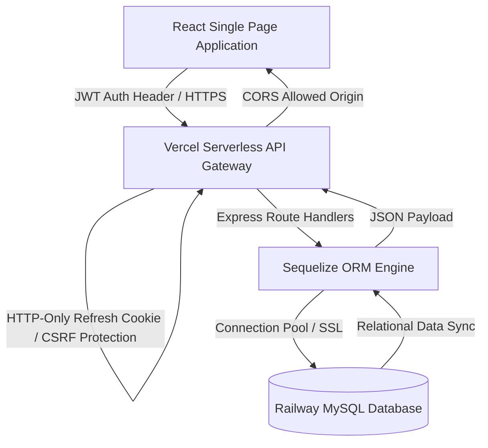

# 🚀 Team Task Manager Pro
### *Enterprise-grade Team Collaboration & Task Management SaaS Platform*

[](https://react.dev/)
[](https://nodejs.org/)
[](https://expressjs.com/)
[](https://www.mysql.com/)
[](https://jwt.io/)
[](https://vercel.com/)
[](https://tailwindcss.com/)

A secure, performance-optimized, and role-based SaaS project management platform architected using the React-Express-MySQL stack. Built with modern Agile workflows in mind, **Team Task Manager Pro** enables teams to collaborate, track task states in real-time, analyze performance metrics via visual dashboards, and audit activities dynamically.

---

## 🔗 Live Deployments & Demo

| Service | Deployment URL | Platform |
| :--- | :--- | :--- |
| **Frontend App** | [https://team-task-manager-blush-one.vercel.app](https://team-task-manager-blush-one.vercel.app) | Vercel |
| **Backend Rest API** | [https://team-task-manager-84ee-git-main-reddys-projects-4cd73f89.vercel.app](https://team-task-manager-84ee-git-main-reddys-projects-4cd73f89.vercel.app) | Vercel Serverless |
| **Database Instance** | Public Proxy Access Enabled | Railway MySQL |

> **Interactive Demo Video**: [Watch the Walkthrough & Tech Architecture Video](https://github.com/20A21A04D2/Team-Task-Manager) *[Placeholder for your video link]*

---

## ✨ Features Matrix

### 🔐 Core Enterprise Features
* **Role-Based Access Control (RBAC)**: Distinct permissions for `Admin` and `Member` roles. Admins manage users, project creation, and team configuration; Members collaborate on projects and execute tasks.
* **Dynamic Kanban Board**: Drag-and-drop task tracking representing statuses: `To Do`, `In Progress`, `Under Review`, and `Completed`.
* **Analytics Dashboard**: Multi-dimensional visual charts built with `Recharts` showing task completion rates, project progress, and workload distribution.
* **Audit Trails & Activity Logs**: Logging of all system transactions (task creations, updates, state changes, project assignments) to keep teams accountable.
* **Real-time Notifications**: Custom event-driven notification dispatch system to keep assignees updated about task actions.

### ⚡ Architectural & Security Highlights
* **Secure Session Cookies**: HTTP-Only, cross-site, secure JWT cookies protecting refresh tokens against XSS attacks, coupled with memory-stored access tokens.
* **Vercel Serverless Optimization**: Optimized middleware stack and Sequelize pooling settings configured for serverless execution.
* **Robust Request Validation**: Comprehensive API input validation sanitization via `express-validator` to prevent SQL Injection and XSS.
* **Intelligent API Rate Limiting**: Customized rate-limiting middleware preserving resources against brute force and DDoS vectors.

---

## 🏗️ System Architecture & API Flow



### Database Entity Relationship Diagram (ERD)
* **Users (1) ── (N) Projects**: Owner relationship.
* **Users (N) ── (M) Projects**: Many-to-Many team membership via `ProjectMembers`.
* **Projects (1) ── (N) Tasks**: Projects hold multiple tasks.
* **Users (1) ── (N) Tasks**: Assignee relationships.
* **Tasks (1) ── (N) Comments**: Threaded task discussions.
* **Users (1) ── (N) Notifications**: Target recipients for activity logs.

---

## 🛠️ Technology Stack

| Technology | Purpose | Key Libraries Used |
| :--- | :--- | :--- |
| **Frontend** | Responsive SPA, State & Routing | React 19, React Router v7, Axios, Context API |
| **Styling** | UI Design & Micro-animations | Tailwind CSS v4, Framer Motion, Lucide Icons |
| **Data Viz** | Interactive Charts & Metrics | Recharts |
| **Backend** | REST API & Core Controller Logic | Node.js, Express.js v5 |
| **ORM** | Database Schema Sync & Migration | Sequelize v6, MySQL2 Driver |
| **Database** | ACID Relational Store | MySQL 8 |
| **Security** | Authentication & Encryption | JSON Web Tokens, bcryptjs, Helmet, Express Rate Limit |

---

## 📂 Monorepo Directory Layout

```
.
├── backend/                  # REST API Server
│   ├── config/               # Database Connection & Sequelize setup
│   ├── controllers/          # Business logic handlers (Auth, Tasks, Projects)
│   ├── middlewares/          # Auth guards, RBAC, Validation & Error Handling
│   ├── models/               # Sequelize Schema Definitions (User, Task, Project)
│   ├── routes/               # API endpoint routing mapping
│   ├── utils/                # Helper files for logging and JWT token generation
│   ├── server.js             # Main server entry file
│   └── vercel.json           # Vercel Serverless config
├── frontend/                 # Client React SPA
│   ├── src/
│   │   ├── components/       # Custom reusable UI components (Buttons, Modals, Inputs)
│   │   ├── context/          # React Contexts (AuthContext, NotificationsContext)
│   │   ├── layouts/          # Persistent page frames (DashboardLayout)
│   │   ├── pages/            # View Containers (Dashboard, Login, AdminPanel)
│   │   ├── services/         # Axios API abstraction layer
│   │   ├── App.jsx           # Client root and Router configuration
│   │   └── index.css         # Tailwind directives and design system tokens
└── package.json              # Monorepo build and start configuration
```

---

## 🚀 Installation & Local Setup

### Prerequisites
* [Node.js](https://nodejs.org/en) (v18.x or higher)
* [MySQL Server](https://dev.mysql.com/downloads/mysql/) running locally or hosted

### Step-by-Step Installation

1. **Clone the Repository**
   ```bash
   git clone https://github.com/20A21A04D2/Team-Task-Manager.git
   cd Team-Task-Manager
   ```

2. **Configure Environment Variables**
   Create a `.env` file inside the `backend` directory:
   ```env
   PORT=5000
   DB_NAME=team_task_manager
   DB_USER=root
   DB_PASSWORD=YourLocalMySQLPassword
   DB_HOST=localhost
   DB_PORT=3306
   DB_DIALECT=mysql
   JWT_SECRET=your_super_secret_jwt_key_12345
   JWT_EXPIRES_IN=7d
   ```

3. **Install Dependencies & Build**
   In the root directory, install all dependencies for both frontend and backend and run the build:
   ```bash
   npm run build
   ```

4. **Start the Application**
   * **Run Backend (Port 5000)**:
     ```bash
     cd backend
     npm run dev
     ```
   * **Run Frontend (Port 5173)**:
     ```bash
     cd ../frontend
     npm run dev
     ```

---

## 🌐 Production Deployment configuration

### 1. Backend Server Deployment (Vercel)
The backend is configured as a serverless project deploying the `backend/` subdirectory.
* Configured in `backend/vercel.json` to route all endpoints `/` to `server.js` using `@vercel/node`.
* Connects using `MYSQL_URL` env variable pointing to your Railway MySQL instance.

### 2. Frontend SPA Deployment (Vercel)
Deployed using `@vercel/static-build` pointing to the `frontend/` directory.
* Set the environment variable `VITE_API_URL` to point to your live Vercel backend API: `https://your-backend.vercel.app/api`.

---

## 📊 Core API Endpoints

### Authentication
* `POST /api/auth/register` - Create a new account.
* `POST /api/auth/login` - Authenticate user and issue tokens (JWT payload + refresh token set cookie).
* `POST /api/auth/logout` - Clear authentication sessions.
* `GET /api/auth/me` - Retrieve authenticated user profile info.

### Project Management
* `GET /api/projects` - Get all projects associated with the logged-in user.
* `POST /api/projects` - Create a new project (Admin only).
* `GET /api/projects/:id` - Fetch detailed info for a specific project.
* `DELETE /api/projects/:id` - Delete a project (Admin only).

### Task Operations
* `GET /api/tasks` - Fetch tasks belonging to a project.
* `POST /api/tasks` - Create a task and assign it to a team member.
* `PUT /api/tasks/:id` - Update task details or progress status (Kanban drag-and-drop handler).
* `DELETE /api/tasks/:id` - Remove a task.

---

## ⚡ Performance Optimizations
* **Bundle Optimization**: Code splitting and lazy loading of React routes via `Suspense` and `lazy` to keep initial load bundles small.
* **Sequelize Connection Pooling**: Configured max/min connections and idle timeouts to optimize connection lifecycle and avoid MySQL connection exhaustion in serverless runtimes.
* **Component Memoization**: Preventing unnecessary rerenders on complex dashboard charts using functional design patterns.

---

## 🏆 Summary of Architecture
> "This project demonstrates production-level full-stack engineering practices including scalable architecture, secure authentication, enterprise UI/UX, REST API design, and deployment-ready implementation."
